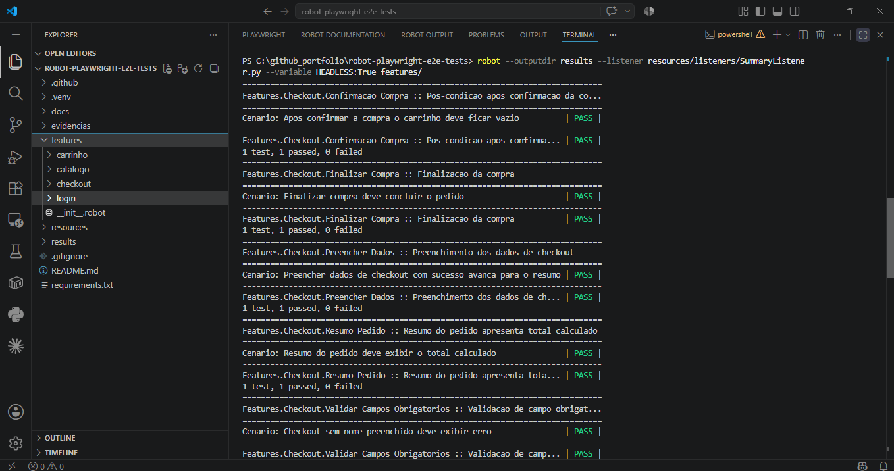
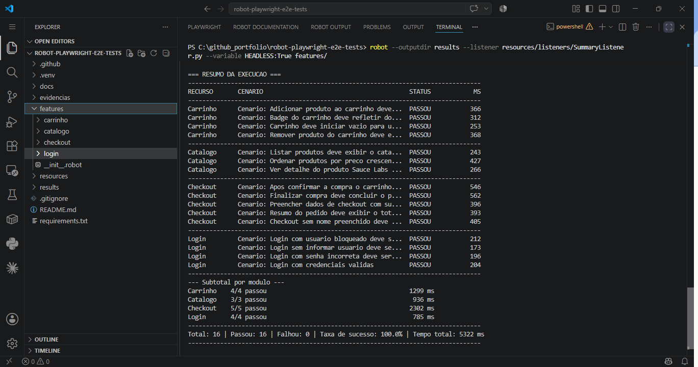
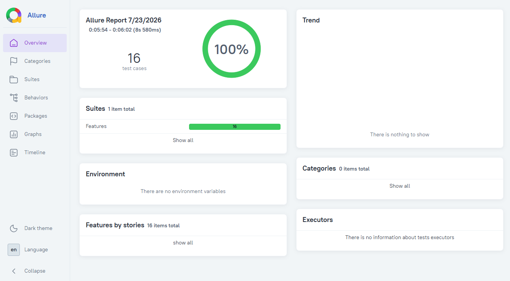
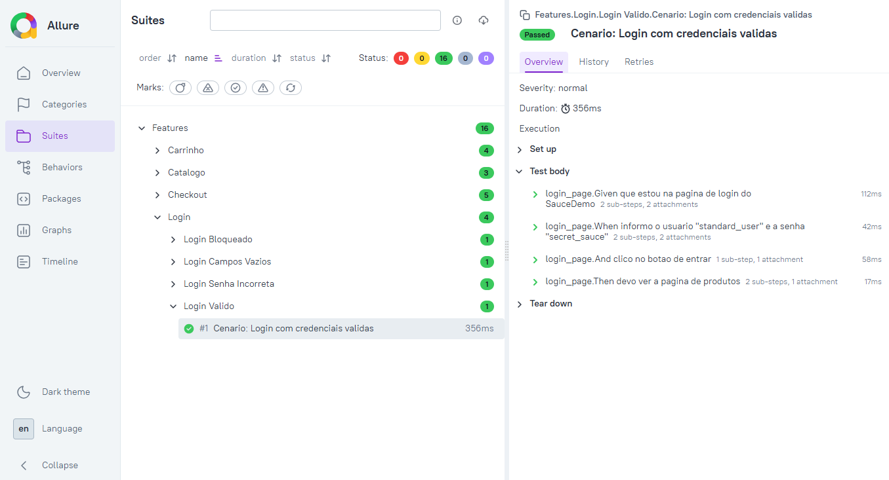
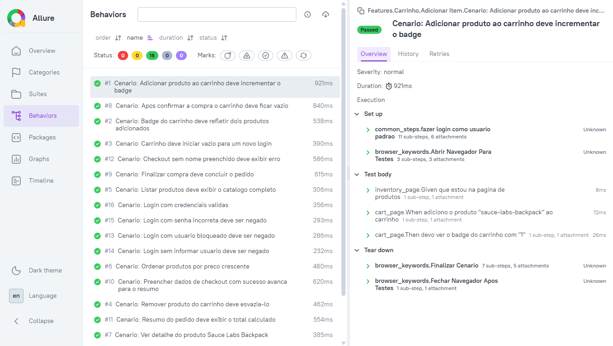
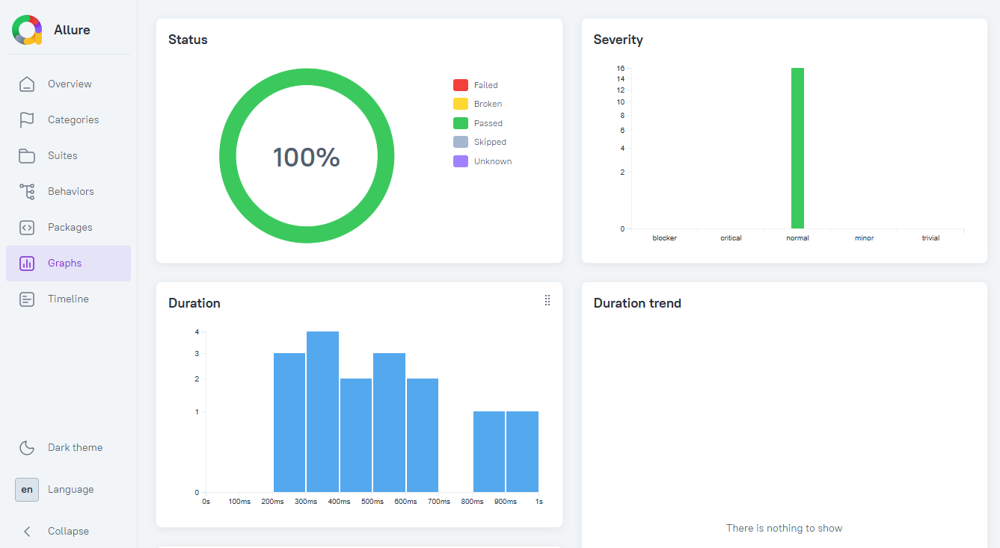

# robot-playwright-e2e-tests

Testes E2E (End-to-End) de interface web, com **Robot Framework + Browser Library** (Playwright por trás).


---

## 🚀 Como instalar e executar

Guia completo para quem está clonando este repositório pela primeira vez. Siga os passos **na ordem**.

### Pré-requisitos

- **Python 3.10+** ([python.org/downloads](https://www.python.org/downloads/))
- **Node.js** (necessário para os binários do Playwright usados pela Browser Library) — [nodejs.org](https://nodejs.org/)

### 1. Clone o repositório

```bash
git clone https://github.com/moiseschiaretto/robot-playwright-e2e-tests.git
cd robot-playwright-e2e-tests
```

### 2. Crie e ative o ambiente virtual

```bash
python -m venv .venv
```

**Windows:** `.\.venv\Scripts\Activate.ps1` | **Linux/Mac:** `source .venv/bin/activate`

**✅ Verificação:** o prompt deve mostrar `(.venv)` no início.

### 3. Instale as dependências Python

```bash
pip install -r requirements.txt
```

### 4. Instale os binários do navegador (passo específico deste projeto)

⚠️ Diferente de um projeto de API, este projeto abre um navegador de verdade — por isso precisa de um passo extra, executado **uma única vez**:

```bash
rfbrowser init
```

Isso baixa os binários do Chromium (e opcionalmente Firefox/WebKit) usados pela Browser Library por trás do Playwright. Sem esse passo, o primeiro teste falha ao tentar abrir o navegador.

**✅ Verificação:** o comando deve terminar sem erro, exibindo confirmação de download dos binários.

### 5. Execute os testes

```bash
robot --outputdir results --listener resources/listeners/SummaryListener.py features/
```

Por padrão, os testes rodam com o navegador visível (`HEADLESS=False`). Para rodar sem abrir janela (modo CI):

```bash
robot --outputdir results --listener resources/listeners/SummaryListener.py --variable HEADLESS:True features/
```

Relatórios em `results/report.html` e `results/log.html`.

> ⚠️ Sempre use `--outputdir results`. Sem esse parâmetro, os relatórios ficam soltos na raiz do projeto.

---

## 📊 Relatório Allure (opcional)

Mesmo padrão do projeto irmão [`robot-api-contract-tests`](https://github.com/moiseschiaretto/robot-api-contract-tests) — consulte aquele README para o passo a passo completo de instalação da CLI (Scoop/Chocolatey/Homebrew) caso ainda não tenha o Allure instalado.

### Gerar os dados do relatório

```bash
robot --outputdir results --listener resources/listeners/SummaryListener.py --listener allure_robotframework:results/allure-results features/
```

### Abrir o relatório

```bash
allure serve results/allure-results
```

> ⚠️ Não abra os arquivos do Allure com duplo clique / `file://` no navegador — use sempre `allure serve`.

---

## Sobre o projeto

Projeto irmão do [`playwright-frontend-e2e-tests`](https://github.com/moiseschiaretto/playwright-frontend-e2e-tests) (TypeScript) e do [`robot-api-contract-tests`](https://github.com/moiseschiaretto/robot-api-contract-tests) (Robot Framework, API) — mesma disciplina de testes E2E/API, aplicada com stacks diferentes.

### Site-alvo: SauceDemo

[saucedemo.com](https://www.saucedemo.com) — e-commerce de demonstração mantido pela Sauce Labs, com 4 perfis de usuário que habilitam cenários de borda:

| Usuário | Comportamento |
|---|---|
| `standard_user` | Fluxo normal (usado na maioria dos cenários) |
| `locked_out_user` | Bloqueado no login |
| `problem_user` | Imagens/UI quebradas (não coberto nesta fase) |
| `performance_glitch_user` | Lentidão proposital (não coberto nesta fase) |

### Rastreabilidade BDD: cenário → keyword → execução real

Este projeto usa o **suporte nativo a Gherkin do Robot Framework** (`Given`/`When`/`And`/`Then`), combinado com **argumentos embutidos** (embedded arguments) — sem arquivos `.feature` separados e sem camadas de tradução. Cada linha do cenário **é**, literalmente, uma chamada de keyword real, implementada no Page Object correspondente:

```robot
*** Test Cases ***
Cenario: Login com credenciais validas
    Given que estou na pagina de login do SauceDemo
    When informo o usuario "standard_user" e a senha "secret_sauce"
    And clico no botao de entrar
    Then devo ver a pagina de produtos
```

A keyword `informo o usuario "${usuario}" e a senha "${senha}"`, por exemplo, está definida em `resources/pages/login_page.robot` com argumentos embutidos — o texto entre aspas no cenário é capturado diretamente como parâmetro, sem necessidade de arquivo de "step definitions" separado (diferente do Cucumber/Java). Isso significa que abrir o cenário já mostra a implementação completa, em um único lugar.

### Cobertura de cenários

**16 cenários**, em 4 módulos:

| Módulo | Cenários | Cobertura |
|---|---|---|
| Login | 4 | Válido, usuário bloqueado, senha incorreta, campo obrigatório vazio |
| Catálogo | 3 | Listar produtos, ordenar por preço, ver detalhe do produto |
| Carrinho | 4 | Adicionar item, remover item, badge com múltiplos itens, carrinho vazio |
| Checkout | 5 | Preencher dados, validar campo obrigatório, resumo do pedido, finalizar compra, pós-condição (carrinho resetado) |

### Estrutura do projeto

```
robot-playwright-e2e-tests/
├── features/
│   ├── __init__.robot    # Abre o navegador uma unica vez para toda a execucao
│   ├── login/            # 4 cenarios
│   ├── catalogo/         # 3 cenarios
│   ├── carrinho/         # 4 cenarios
│   └── checkout/         # 5 cenarios
├── resources/
│   ├── pages/            # Page Objects com keywords BDD (argumentos embutidos)
│   │   ├── login_page.robot
│   │   ├── inventory_page.robot
│   │   ├── cart_page.robot
│   │   └── checkout_page.robot
│   ├── keywords/
│   │   ├── browser_keywords.robot   # Setup/teardown global de navegador + captura de print por cenario
│   │   └── common_steps.robot       # Pre-condicao de login, reutilizada por 3 modulos
│   ├── listeners/
│   │   └── SummaryListener.py       # Resumo da Execucao (reaproveitado do robot-api-contract-tests)
│   └── variables.robot
├── results/               # Relatorios (report.html, log.html, allure-results/)
├── evidencias/            # Print de cada cenario, com data/hora — nao versionado (.gitignore)
├── docs/screenshots/
├── .github/workflows/e2e-tests.yml
├── requirements.txt
└── .gitignore
```

### Evidências de execução

Cada cenário gera automaticamente um print de tela ao final, salvo em `evidencias/`, nomeado com data e hora da execução (ex: `20260723_143512_Cenario_Login_com_credenciais_validas.png`). Essa pasta **não é versionada no Git** (está no `.gitignore`) — são evidências locais de cada rodada, não artefatos de código-fonte.

O navegador abre **uma única vez** para toda a execução (configurado em `features/__init__.robot`, mecanismo nativo do Robot Framework para inicializar uma pasta inteira como suite única) — não mais uma janela por cenário. Para garantir que cada cenário comece com carrinho e sessão limpos (sem depender de reabrir o navegador), cada cenário termina limpando `localStorage`/`sessionStorage` do navegador via JavaScript (`Finalizar Cenario`, em `browser_keywords.robot`) — funciona igual em qualquer página, inclusive nos cenários de login negativo.

**Console de execução (Robot Framework nativo + Resumo da Execução):**


*Console nativo do Robot Framework rodando o módulo Checkout — cada cenário aparece com seu status (PASS) individual.*


*Resumo da Execução, gerado pelo `SummaryListener.py`: os 16 cenários agrupados por módulo, com subtotal e taxa de sucesso (100%).*

**Relatório Allure:**


*Visão geral do Allure: 16 test cases, 100% de sucesso na execução.*


*Detalhamento de um cenário individual (Login Válido), mostrando cada passo Given/When/Then executado.*


*Todos os 16 cenários listados por comportamento (Behaviors), com tempo de execução individual.*


*Gráficos consolidados: status geral, severidade dos testes e distribuição de duração por cenário.*

### Por que Robot Framework + Browser Library (e não Selenium)

A Browser Library é a recomendação atual de mercado para novos projetos Robot Framework (2026): é mais rápida que a SeleniumLibrary, tem auto-wait nativo (menos `Sleep` espalhado pelo código) e lida melhor com aplicações modernas — e, por rodar Playwright por trás, testa **a mesma camada** já coberta no `playwright-frontend-e2e-tests`, só que com uma ferramenta diferente, demonstrando duas abordagens de mercado para o mesmo tipo de teste.

